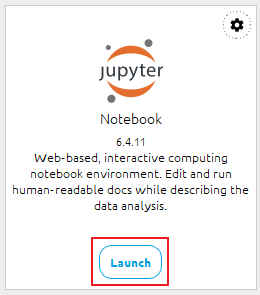
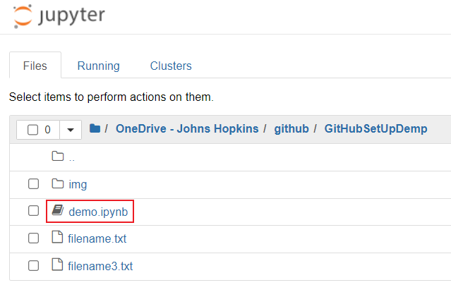
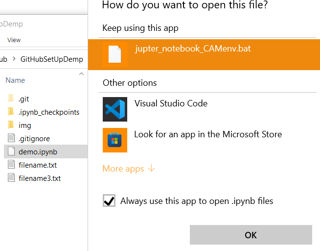
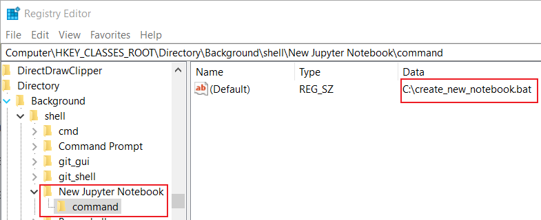

## Create and Open Jupyter Notebook on Windows through right click menu

### Problem:

How did you open Jupyter Notebook? How did you launch an exist Notebook? Here is what I did before (pretty annoying):

open anaconda navigation:



find the file in the path:



If I need to create a new file, I need to open an exist file then create a new one:


Is there a faster way to open an exist notebook file, and create a new one. Just like create a new word file and open it?


### Open an existing Notebook

Actually, we can open the Notebook, with some cmd commands.

First run `cwp.py` to set path to anaconda environment directory:

> python cwp.py [path]
>
> Ex: C:\anaconda3\python.exe C:\anaconda3\cwp.py C:\anaconda3\envs\CAMenv 

Then use `jupyter-notebook-script.py` to open the file. Change `[CAMenv]` to your environment.

> [in CAMenv environment]python jupyter-notebook-script.py %1
>
> Ex: C:\anaconda3\envs\CAMenv\python.exe C:\anaconda3\envs\CAMenv\Scripts\jupyter-notebook-script.py %1

So now, we can put these two command into a `.txt` file,and change the extension to `.bat``


find a notebook and use this batch file to open it.



Now you can open the `.ipynb` file with double click.

### Create a new Notebook in right click menu

The idea comes from [this link]([python - How to create and open a jupyter notebook ipynb file directly from terminal - Stack Overflow](https://stackoverflow.com/questions/48946639/how-to-create-and-open-a-jupyter-notebook-ipynb-file-directly-from-terminal)). However this link is for Linux system. We will first write a python file to create the notebook for us.

> ```py
> """create-notebook.py
>    Creates a minimal jupyter notebook (.ipynb)
>    Usage: create-notebook <notebook>
> """
> import sys
> from notebook import transutils as _
> from notebook.services.contents.filemanager import FileContentsManager as FCM
> 
> try:
>     notebook_fname = sys.argv[1].strip('.ipynb')
> except IndexError:
>     print("Usage: create-notebook <notebook>")
>     exit()
> 
> notebook_fname += '.ipynb'  # ensure .ipynb suffix is added
> FCM().new(path=notebook_fname)
> ```


This file will accept an argument as the filename. The usage is `python create-notebook.py Newnotebook`

Now we will create a batch file (name it `create_new_notebook.bat`), Change `[CAMenv]` to your environment:

> conda activate CAMenv  & python.exe C:\create-notebook.py new_notebook


**Potential warning:** Some python virtual environment make not support this line: `from notebook.services.contents.filemanager import FileContentsManager as FCM`. I choose to run this file in my `conda` environment, so run `conda activate CAMenv` command first.

##### Interpretation:

 `&` in batch file means run the next command after finish the former one. Suppose the create-notebook.py file is under `C:\` drive, and the environment is `CAMenv`.

##### Add to Right Click Menu:

To open the file in Right Click Menu, we need to change the registry file. Open `Registry editor` in windows. Search this path and add `New Jupyter Notebook` key and `command` subkey. Change`command` subkey value to the path you put the `.bat` file.



Now you should see a new option in the Right Click Menu:

